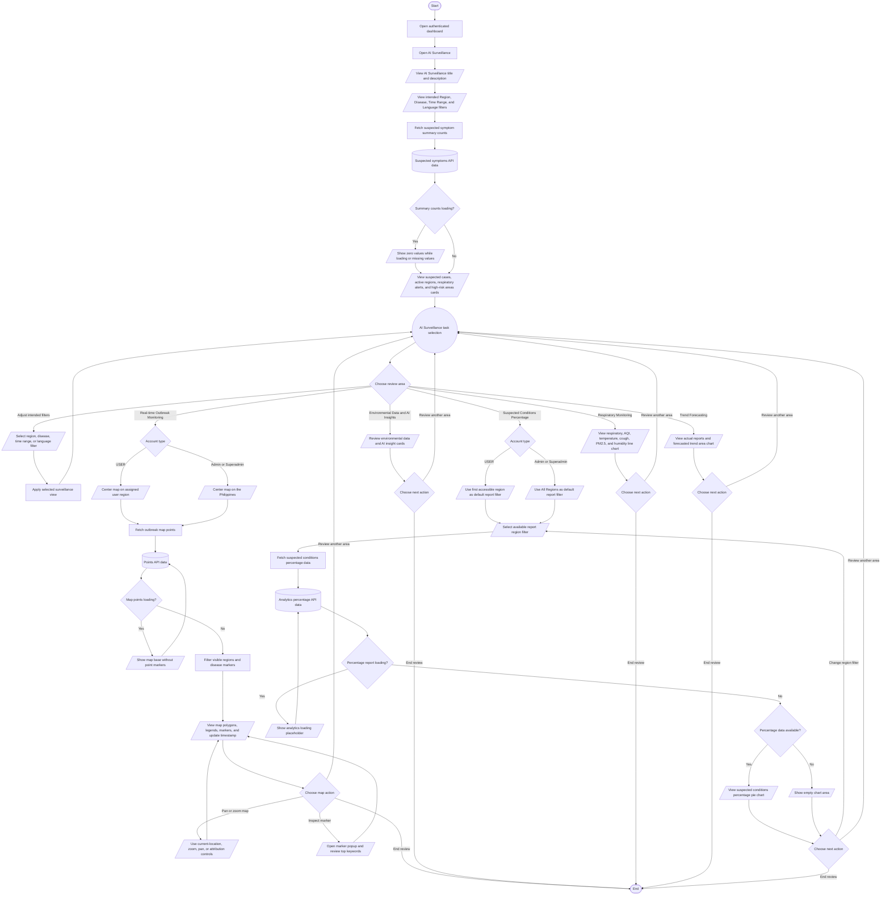

# AI Surveillance Process Flowchart

## Purpose

This document summarizes the current authenticated-user journey in the HealthPH+ AI Surveillance dashboard. It simplifies the process from opening the dashboard through reviewing intended surveillance filters, suspected case summaries, outbreak map data, environmental and AI insight panels, respiratory and forecasting charts, and the suspected conditions percentage report.

## Scope

The flow focuses on the current dashboard-level AI Surveillance interface for authenticated users. It documents role-aware map and report defaults, intended global dashboard filters, loading states for live surveillance data, visible static dashboard panels, chart review behavior, and region-filter behavior for the suspected conditions percentage report.

## Flowchart Symbol Legend

| Symbol | Meaning | Mermaid example |
| --- | --- | --- |
| Terminator | Start or end of a process | `([Start])` |
| Process | Action or system step | `[Open dashboard]` |
| Decision | Yes/no or branching question | `{Choose review area}` |
| Input/Output | User input, visible output, or notification | `[/View chart/]` |
| Document/Report | Printable or exportable output | `[/View report/]` |
| Database | Stored system data | `[(Surveillance API data)]` |
| Connector | Return point or continuation | `((AI Surveillance task selection))` |

## Main AI Surveillance Flow

## Notes

- AI Surveillance is available as the authenticated dashboard default page through the `/dashboard` route.
- The page fetches suspected symptom counts with `useGenerateSuspectedSymptomsQuery`.
- Suspected symptom counts display `0` while the request is fetching or when a count value is missing.
- The summary area includes Suspected Cases, Active Regions, Respiratory Alerts, and High Risk Areas cards.
- The Suspected Cases card uses API data for total, TB, COVID, Pneumonia, and AURI counts.
- Active Regions, Respiratory Alerts, and High Risk Areas use visible static values in the current component.
- The dashboard shows Region Filter, Disease Filter, Time Range, and Language controls as intended global filters in the current interface.
- The current AI Surveillance component stores region, disease, and date-range filter state for the map, but the visible top filter controls are not wired to update that state yet.
- The outbreak map fetches point data with `useFetchPointsQuery`.
- USER accounts center the outbreak map on the user's assigned region.
- Admin and Superadmin accounts center the outbreak map on the Philippines.
- The map displays legends for PTB, Pneumonia, COVID, and AURI.
- The map displays region polygons when the selected map regions do not include every listed region.
- Map markers are hidden while points are loading.
- Map point markers are filtered by accessible or selected regions and exclude points whose annotations include `X`.
- Marker popups display up to three top keywords from the point record.
- The map includes visible attribution, current-location, zoom, pan, and popup interactions.
- Environmental Data displays static Air Quality Index, Weather Pattern, and Heat Index values in the current component.
- AI Insights displays static insight cards in the current component.
- Respiratory Monitoring displays static line chart data for respiratory rate, AQI, temperature, cough frequency, PM2.5, and humidity.
- Trend Forecasting displays static actual report and forecasted trend data.
- Suspected Conditions Percentage uses `useGeneratePercentageQuery` and displays a pie chart when percentage data is available.
- Admin and Superadmin users default the Suspected Conditions Percentage report filter to `all`.
- USER accounts default the Suspected Conditions Percentage report filter to the first accessible region.
- The shared `Report` component limits USER report filter options to regions included in `user.accessible_regions`; other authenticated users can choose from all listed regions.
- The current component does not include export actions, print report generation, persistence, activity logging, editable AI configuration, or dedicated API error states.
