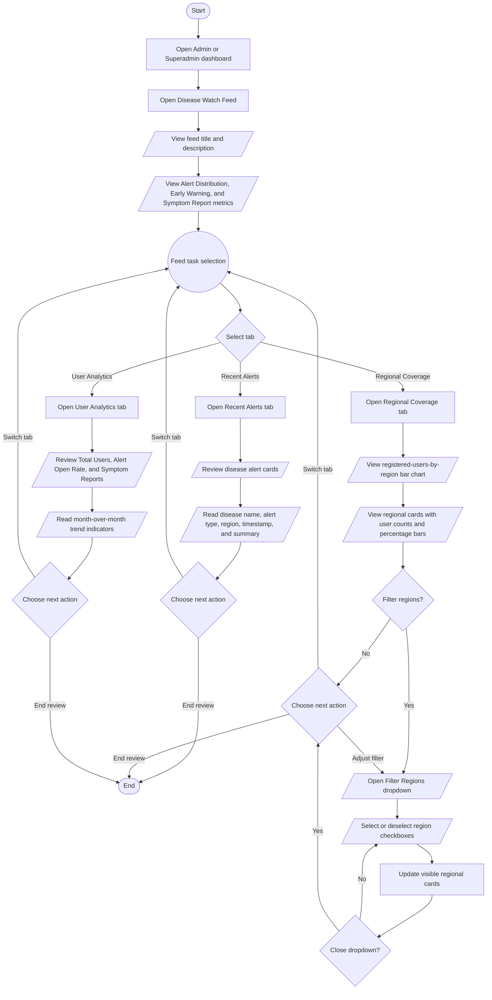

# Disease Watch Feed Process Flowchart

## Purpose

This document summarizes the intended Admin and Superadmin journey in the HealthPH+ Disease Watch Feed. It simplifies the process from opening the feed through reviewing summary metrics, checking recent alerts, filtering regional coverage, and reviewing user engagement analytics.

## Scope

The flow focuses on the current dashboard-level Disease Watch Feed interface for Admin and Superadmin users. It documents the implemented tab navigation, visible mock dashboard data, and regional filtering behavior only.

## Flowchart Symbol Legend

| Symbol | Meaning | Mermaid example |
| --- | --- | --- |
| Terminator | Start or end of a process | `([Start])` |
| Process | Action or system step | `[Open dashboard]` |
| Decision | Yes/no or branching question | `{Select tab}` |
| Input/Output | User input, visible output, or notification | `[/View alerts/]` |
| Document/Report | Printable or exportable output | `[/Export report/]` |
| Database | Stored system data | `[(Disease watch data)]` |
| Connector | Return point or continuation | `((Feed task selection))` |

## Main Disease Watch Feed Flow

## Notes

- The Disease Watch Feed opens with three top metrics: Alert Distribution, Early Warning, and Symptom Report.
- The dashboard includes Recent Alerts, Regional Coverage, and User Analytics tabs.
- Recent Alerts displays alert cards with disease name, alert type, region, timestamp, and short summary.
- Regional Coverage displays a registered-users-by-region bar chart and regional cards.
- The Regional Coverage filter uses a dropdown with region checkboxes. Selecting regions limits the visible regional cards to the selected regions.
- When no regions are selected, all regional cards are visible.
- User Analytics summarizes total users, alert open rate, and symptom reports with month-over-month trend indicators.
- The current component uses local mock data and does not include backend ingestion, exports, reporting, persistence, or activity logging behavior.
