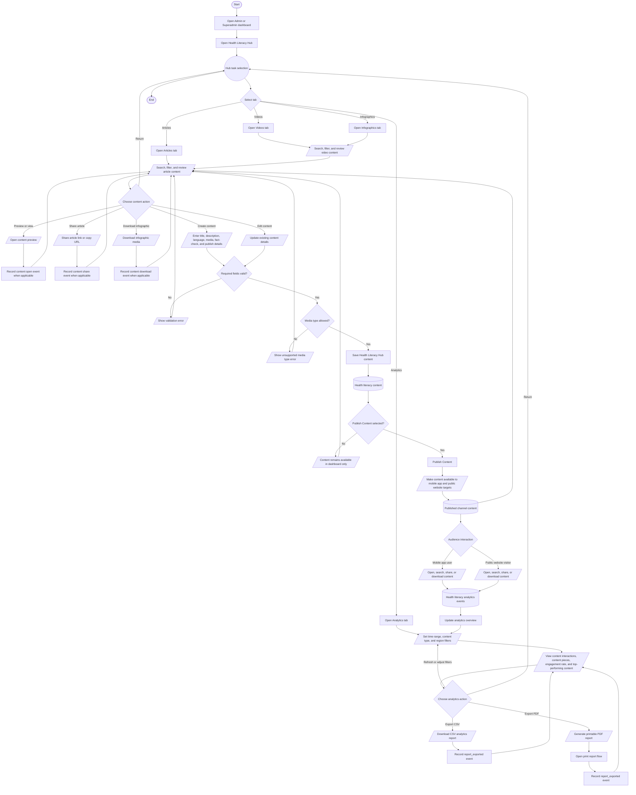

# Health Literacy Hub Process Flowchart

## Purpose

This document summarizes the intended Admin and Superadmin journey in the HealthPH+ Health Literacy Hub. It simplifies the process from opening the hub through content management, publishing to public channels, analytics review, and CSV or PDF export actions.

## Scope

The flow focuses on dashboard-level Health Literacy Hub actions for Admin and Superadmin users, with downstream visibility for mobile app and public website audiences. Mobile app and public website publishing are treated as one publishing feature so the chart stays aligned with the dashboard workflow.

## Flowchart Symbol Legend

| Symbol | Meaning | Mermaid example |
| --- | --- | --- |
| Terminator | Start or end of a process | `([Start])` |
| Process | Action or system step | `[Open dashboard]` |
| Decision | Yes/no or branching question | `{Valid content?}` |
| Input/Output | User input, visible output, or notification | `[/Enter content details/]` |
| Document/Report | Printable or exportable output | `[/Export analytics report/]` |
| Database | Stored system data | `[(Health literacy content)]` |
| Connector | Return point or continuation | `((Hub task selection))` |

## Main Health Literacy Hub Flow

## Notes

- The dashboard includes Articles, Videos, Infographics, and Analytics tabs.
- Articles support text content. Videos accept video media. Infographics accept image media and include a download action.
- Content creation and editing validate required title and description fields. Articles and videos require at least one supported language. Uploaded media must match the selected content type.
- Publish Content is one dashboard feature. The saved content may target the mobile app, the public website, or both, but the process is documented as a single publishing workflow.
- Published content excludes archived content and is available through the Health Literacy Hub mobile and website endpoints.
- Mobile app and public website interactions can create analytics events such as content opened, content shared, content downloaded, and search.
- Analytics supports filtering by time range, content type, and region. CSV export downloads a generated analytics report. PDF export sends the analytics report through the print report flow.
- CSV and PDF exports record `report_exported` analytics events so exported reports can contribute to administrative audit and engagement context.
