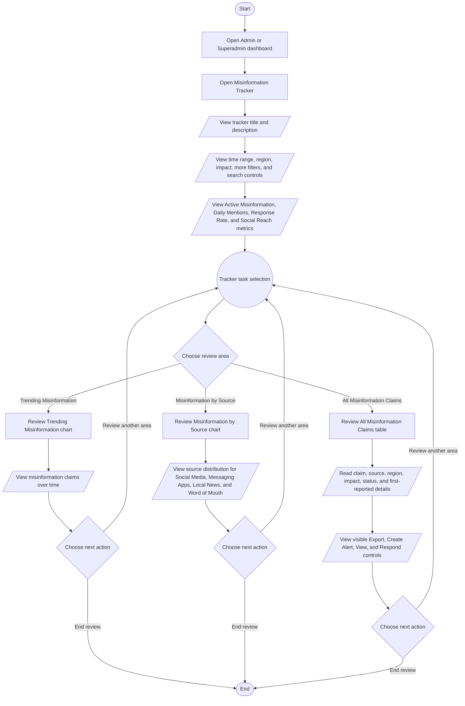

# Misinformation Tracker Process Flowchart

## Purpose

This document summarizes the intended Admin and Superadmin journey in the HealthPH+ Misinformation Tracker. It simplifies the process from opening the tracker through reviewing dashboard filters, summary metrics, misinformation trends, source distribution, and detected misinformation claims.

## Scope

The flow focuses on the current dashboard-level Misinformation Tracker interface for Admin and Superadmin users. It documents the implemented static dashboard data and visible controls only.

## Flowchart Symbol Legend

| Symbol | Meaning | Mermaid example |
| --- | --- | --- |
| Terminator | Start or end of a process | `([Start])` |
| Process | Action or system step | `[Open dashboard]` |
| Decision | Yes/no or branching question | `{Choose next action}` |
| Input/Output | User input, visible output, or notification | `[/Set filters/]` |
| Document/Report | Printable or exportable output | `[/Export report/]` |
| Database | Stored system data | `[(Misinformation data)]` |
| Connector | Return point or continuation | `((Tracker task selection))` |

## Main Misinformation Tracker Flow

## Notes

- The Misinformation Tracker opens with visible time range, region, impact, more filters, and search controls.
- The dashboard includes four summary cards: Active Misinformation, Daily Mentions, Response Rate, and Social Reach.
- Trending Misinformation displays a line chart of misinformation claims over time.
- Misinformation by Source displays a pie chart for Social Media, Messaging Apps, Local News, and Word of Mouth.
- All Misinformation Claims displays claim rows with claim text, source, region, impact, status, first-reported text, and visible action controls.
- Export, Create Alert, View, and Respond are visible controls in the current component, but no export, alert creation, claim detail, or response workflow is implemented in the component.
- More Filters, the impact button, the search field, and the time range and region selects are visible controls, but they do not currently update the local chart or table data in the component.
- The current component uses local static data and does not include backend ingestion, persistence, activity logging, alert publishing, response tracking, or report generation behavior.
