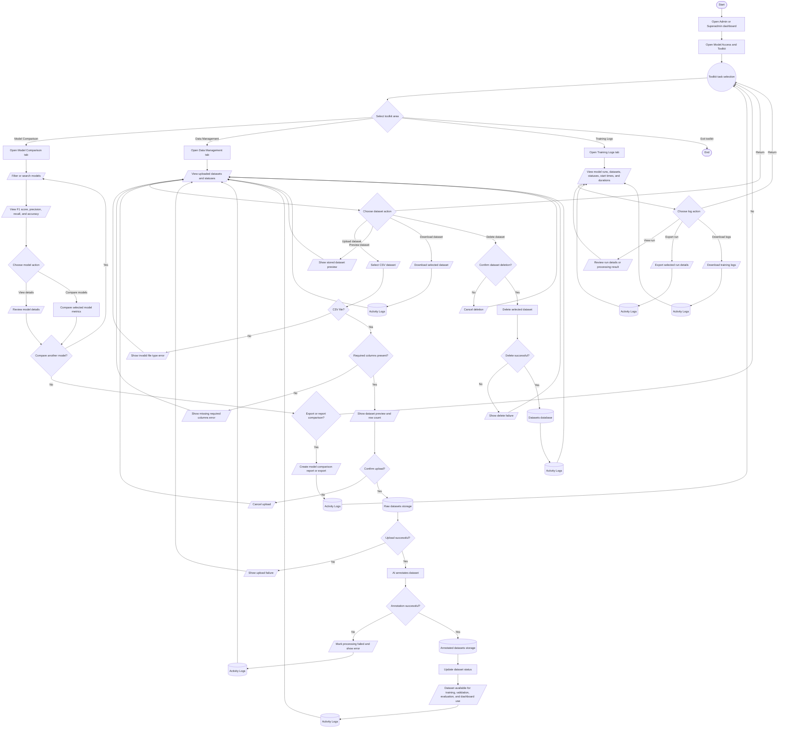

# Model Access Toolkit Process Flowchart

## Purpose

This document summarizes the intended Admin and Superadmin journey in the HealthPH+ Model Access and Toolkit dashboard. It simplifies the process from opening the toolkit through model comparison, dataset upload, AI dataset annotation, dataset administration, training log review, reporting, and export actions.

## Scope

The flow focuses on dashboard-level Model Access and Toolkit actions for Admin and Superadmin users. AI annotation is kept at process level so the chart remains readable and useful as a process reference.

## Flowchart Symbol Legend

| Symbol | Meaning | Mermaid example |
| --- | --- | --- |
| Terminator | Start or end of a process | `([Start])` |
| Process | Action or system step | `[Open dashboard]` |
| Decision | Yes/no or branching question | `{Valid file?}` |
| Input/Output | User input, visible output, or notification | `[/Upload CSV dataset/]` |
| Document/Report | Printable or exportable output | `[/Export training logs/]` |
| Database | Stored system data | `[(Datasets database)]` |
| Connector | Return point or continuation | `((Toolkit task selection))` |

## Main Model Access Toolkit Flow

## Notes

- The flow targets Admin and Superadmin users because dataset upload, delete, export, and audit actions are administrative workflows.
- The dashboard includes Model Comparison, Data Management, and Training Logs areas.
- Uploaded datasets are validated before processing. Invalid file types and missing required columns stop the upload and return the user to Data Management.
- AI annotation is represented at process level. After a valid upload, the system annotates the dataset and makes successful outputs available for model training, validation, evaluation, and downstream dashboard use.
- Dataset management includes preview, download, and delete actions. Dataset deletion requires confirmation and returns to Data Management whether cancelled, failed, or completed.
- Model comparison and training log exports create report or export outputs and record the related administrative action in Activity Logs.
- Annotation or processing failures should be visible through dataset status and training or activity records so admins can review what happened.
