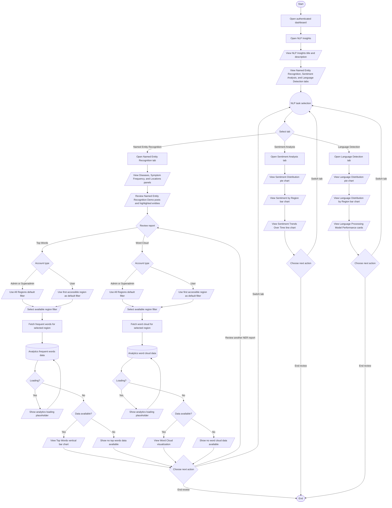

# NLP Insights Process Flowchart

## Purpose

This document summarizes the current authenticated-user journey in the HealthPH+ NLP Insights dashboard. It simplifies the process from opening NLP Insights through reviewing Named Entity Recognition, Sentiment Analysis, Language Detection, and the region-filtered Top Words and Word Cloud reports.

## Scope

The flow focuses on the current dashboard-level NLP Insights interface for authenticated users. It documents the implemented tab navigation, visible static dashboard panels, live Top Words and Word Cloud report queries, loading states, empty states, and region-filter behavior only.

## Flowchart Symbol Legend

| Symbol | Meaning | Mermaid example |
| --- | --- | --- |
| Terminator | Start or end of a process | `([Start])` |
| Process | Action or system step | `[Open dashboard]` |
| Decision | Yes/no or branching question | `{Select tab}` |
| Input/Output | User input, visible output, or notification | `[/View chart/]` |
| Document/Report | Printable or exportable output | `[/View report/]` |
| Database | Stored system data | `[(Analytics API data)]` |
| Connector | Return point or continuation | `((NLP task selection))` |

## Main NLP Insights Flow

## Notes

- NLP Insights is available to authenticated dashboard users through the `/dashboard/nlp-insights` route.
- The dashboard includes three tabs: Named Entity Recognition, Sentiment Analysis, and Language Detection.
- Named Entity Recognition opens by default.
- The Diseases, Symptom Frequency, Locations, and Named Entity Recognition Demo panels use visible static dashboard content in the current component.
- Top Words uses `useGenerateFrequentWordsQuery` and displays a vertical bar chart when frequent word data is available.
- Word Cloud uses `useGenerateWordCloudQuery` and displays a `ReactWordCloud` visualization when word cloud data is available.
- Top Words and Word Cloud show the shared analytics loading placeholder while their report queries are fetching.
- Top Words shows "No top words data available" when no frequent word results are available.
- Word Cloud shows "No word cloud data available" when no word cloud results are available or the response indicates no datasets.
- Admin and Superadmin users default Top Words and Word Cloud filters to `all`.
- USER accounts default Top Words and Word Cloud filters to the first accessible region.
- The shared `Report` component limits USER region filter options to regions included in `user.accessible_regions`; other authenticated users can choose from all listed regions.
- Sentiment Analysis displays static Sentiment Distribution, Sentiment by Region, and Sentiment Trends Over Time chart data in the current component.
- Language Detection displays static Language Distribution, Language Distribution by Region, and Language Processing Model Performance data in the current component.
- The current component does not include export actions, report generation, persistence, activity logging, model execution controls, or editable NLP configuration.
