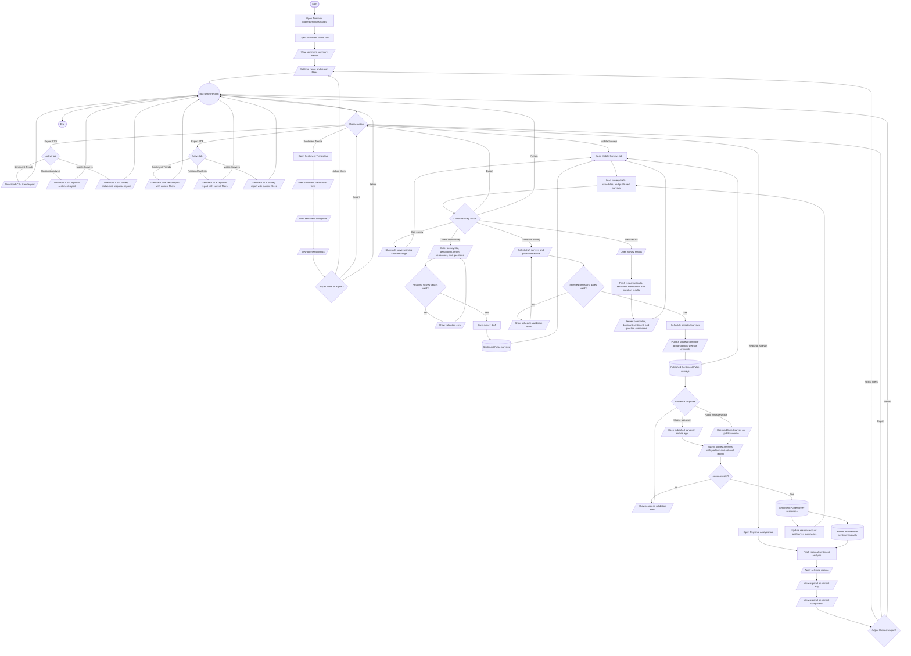

# Sentiment Pulse Tool Process Flowchart

## Purpose

This document summarizes the intended Admin and Superadmin journey in the HealthPH+ Sentiment Pulse Tool. It simplifies the process from opening the tool through dashboard filtering, sentiment review, regional analysis, mobile survey management, public response collection, result review, and CSV or PDF export actions.

## Scope

The flow focuses on dashboard-level Sentiment Pulse Tool actions for Admin and Superadmin users, with downstream visibility for mobile app and public website audiences. Scheduling surveys to the mobile app and public website is treated as one publishing feature so the chart stays aligned with the dashboard workflow.

## Flowchart Symbol Legend

| Symbol | Meaning | Mermaid example |
| --- | --- | --- |
| Terminator | Start or end of a process | `([Start])` |
| Process | Action or system step | `[Open dashboard]` |
| Decision | Yes/no or branching question | `{Valid survey?}` |
| Input/Output | User input, visible output, or notification | `[/Set filters/]` |
| Document/Report | Printable or exportable output | `[/Export report/]` |
| Database | Stored system data | `[(Survey responses)]` |
| Connector | Return point or continuation | `((Tool task selection))` |

## Main Sentiment Pulse Tool Flow

## Notes

- The dashboard includes Sentiment Trends, Regional Analysis, and Mobile Surveys tabs.
- Shared controls include time range filtering, region filtering, CSV export, and PDF export.
- CSV export depends on the active tab: trend data for Sentiment Trends, regional sentiment rows for Regional Analysis, and survey status or response details for Mobile Surveys.
- PDF export is documented as the intended reporting workflow for the active tab, using the current filters and visible dashboard context.
- Sentiment Trends summarizes sentiment over time, sentiment categories, and top health topics.
- Regional Analysis uses the selected time range and regions to show regional sentiment map and comparison views.
- Mobile Surveys supports creating draft surveys, scheduling draft surveys, publishing scheduled surveys, and reviewing survey results.
- Scheduling a survey is documented as one publishing feature for both the mobile app and public website.
- Public mobile app users and public website visitors can open published surveys and submit responses.
- Submitted responses update survey response totals and can contribute to regional sentiment analysis when platform and region signals are available.
