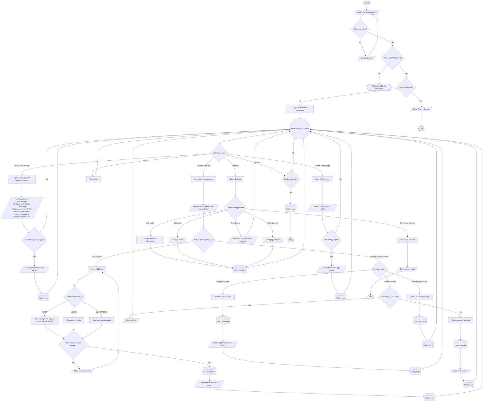

# Superadmin Process Flowchart

## Purpose

This document summarizes the full Superadmin journey in HealthPH+. It simplifies the process from sign in through dashboard navigation, account administration, reporting, settings, and sign out.

## Scope

The flow focuses on what a Superadmin can do inside the dashboard. Module internals are kept high-level so the chart remains readable and useful as a process reference.

## Flowchart Symbol Legend

| Symbol | Meaning | Mermaid example |
| --- | --- | --- |
| Terminator | Start or end of a process | `([Start])` |
| Process | Action or system step | `[Open dashboard]` |
| Decision | Yes/no or branching question | `{Valid login?}` |
| Input/Output | User input, visible output, or notification | `[/Enter credentials/]` |
| Document/Report | Printable or exportable output | `[/Generate report/]` |
| Database | Stored system data | `[(Users database)]` |
| Connector | Return point or continuation | `((Dashboard))` |

## Main Superadmin Flow

## Notes

- Superadmins can access the same dashboard modules as admins, plus elevated account management actions.
- Superadmins can create `USER`, `ADMIN`, and `SUPERADMIN` accounts.
- Superadmins can view all users, admins, and superadmins.
- Superadmins can enable, disable, and delete eligible accounts, but the system blocks deletion of the currently signed-in account from the admin deletion flow.
- Account creation, deletion, enable, and disable actions update stored user data and send email notifications.
- Administrative actions are recorded in Activity Logs when the related screen logs the action.
