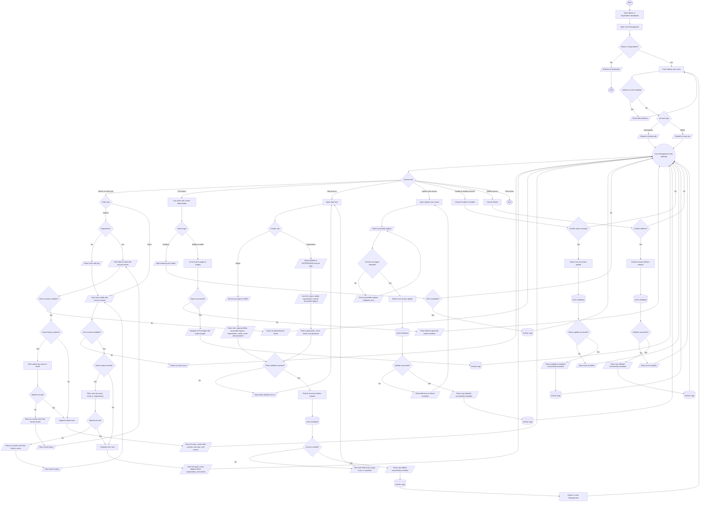

# User Management Process Flowchart

## Purpose

This document summarizes the current Admin and Superadmin journey in the HealthPH+ User Management dashboard. It simplifies the process from opening User Management through viewing account lists, searching records, generating reports, adding accounts, updating user access, enabling or disabling accounts, and deleting eligible accounts.

## Scope

The flow focuses on the current dashboard-level User Management interface for Admin and Superadmin users. It documents implemented role-based tab access, loading states, table search and pagination behavior, report generation, Add User navigation, account action confirmation modals, success and error notifications, and activity logging.

## Flowchart Symbol Legend

| Symbol | Meaning | Mermaid example |
| --- | --- | --- |
| Terminator | Start or end of a process | `([Start])` |
| Process | Action or system step | `[Open dashboard]` |
| Decision | Yes/no or branching question | `{Select tab}` |
| Input/Output | User input, visible output, or notification | `[/View table/]` |
| Document/Report | Printable or exportable output | `[/Generate report/]` |
| Database | Stored system data | `[(Users database)]` |
| Connector | Return point or continuation | `((User Management task selection))` |

## Main User Management Flow

## Notes

- User Management is available through the `/dashboard/user-management` route when the signed-in account is an Admin or Superadmin and the app is not running in PWA mode.
- The page fetches both admin and user records with `useFetchAdminsQuery` and `useFetchUsersQuery`.
- The page shows a table skeleton while either the admins or users request is loading.
- Superadmin users default to the Admins tab and can switch between Admins and Users.
- Admin users default to the Users tab and only receive the Users tab option in the current interface.
- Tab counts update when a search query is entered.
- Admin search matches first name, last name, or email.
- User search matches first name, last name, email, or organization.
- The Admins table displays full name, email, date created, user type, and row actions.
- The Users table displays full name, email, regional office, organization with role label when available, and row actions.
- The table component paginates rows at 10 rows per page.
- Printing uses the active tab and current filtered dataset. The print report displays up to 25 rows per printed page.
- Desktop report generation opens the browser print flow and records a User Management activity log after printing completes.
- Mobile and tablet report generation converts print pages to images and navigates to the `/print` route with activity-log data.
- Failed mobile or tablet report image generation shows "Failed to generate report. Please try again."
- The Add User page is available from User Management for Admin and Superadmin users.
- Admin users create USER accounts. The form automatically sets the user type to `USER`.
- Superadmin users create ADMIN or SUPERADMIN accounts in the current Add User select options.
- USER account creation includes role, regional office, accessible regions, organization, first name, last name, email, and password.
- ADMIN and SUPERADMIN account creation defaults the region to `ALL`, organization to the configured admin organization, and accessible regions to all listed regions.
- Account creation validates required fields, email format, password requirements, and server-side API responses before returning to User Management.
- Successful account creation shows "User added successfully", logs the action in Activity Logs, and returns to `/dashboard/user-management`.
- USER row updates only change accessible regions through the Update modal.
- Enable, disable, and delete actions require confirmation modals before submitting the API request.
- Successful update, enable, disable, and delete actions show success snackbars and write User Management entries to Activity Logs.
- Failed update, enable, disable, delete, or account creation requests show field errors, page errors, or destructive snackbars depending on the API response.
- The current User Management component declares admin and user error flags but does not render a dedicated fetch-error state.
